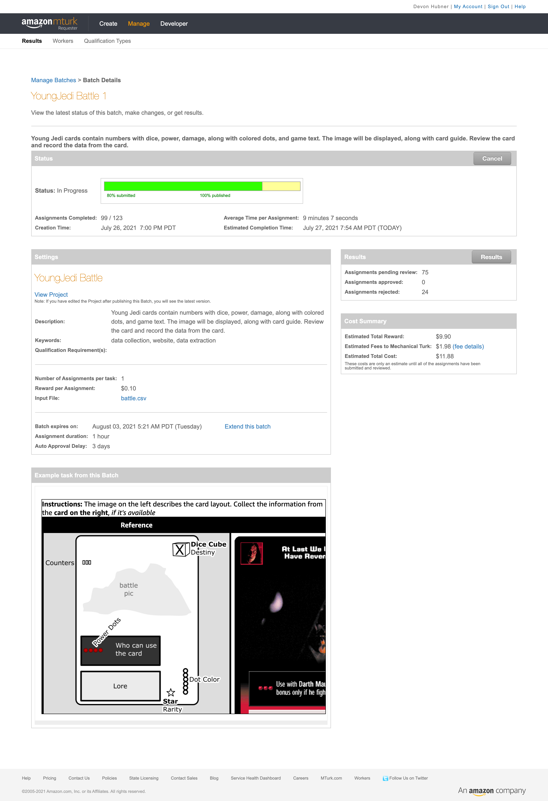

## Mechanical Turk

Amazon Mechanical Turk allows for the creation of jobs tobe executed by humans.

A list of all cards was created, separated by type, with a guideline image and an entry form. The humans would transcribe the data from each card and enter it in to the Mechanical Turk system. The results are a CSV file with the details of the cards.

